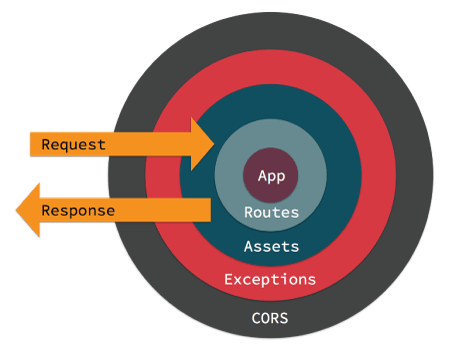

# 미들웨어란?
redux 미들웨어에서 볼 수 있는 패턴으로서의 미들웨어에 대해 살펴보겠습니다.
아래의 그림으로 이해해 볼 수 있습니다.


이미지 출처: https://book.cakephp.org/3/en/controllers/middleware.html

원래 시스템에 새로운 layer들을 추가하여 파이프라인 형태로 기능을 증강시킵니다.

인터셉터 필터 패턴 (https://en.wikipedia.org/wiki/Intercepting_filter_pattern) + 책임 사슬 패턴(https://en.wikipedia.org/wiki/Chain-of-responsibility_pattern) 이라고도 할 수 있으며,
다시 말하면

원본을 유지한 채로 / 이전의 응답을 다음 요청으로 chaining 시킬 수 있습니다.
decorator와 비교해보면, 시스템 자체가 기능 증강을 하는 것이 아니라 원본은 유지하고 추가된 미들웨어만큼 증강이 되므로 plug-in/out이 용이합니다.

소프트웨어에서의 미들웨어들을 관찰해보면 조금 더 구체적인 모양새를 갖게 되는데,
미들웨어들을 추가할 수 있는 하나의 미들웨어 관리자를 두고 있습니다.
express.use
redux의 applyMiddleware 등입니다.

또한 각 미들웨어들은 이전 미들웨어의 실행 결과를 입력으로 받아 순차적으로 처리할 수 있는 특징이 있습니다.


# Redux middleware

store에는 dispatch, subscribe, getState, replaceReducer, @observable 의 함수가 있습니다.

하고자 하는 바를 에시로 들어보겠습니다.

```
<form onSubmit={e => {
        e.preventDefault()
        if (!input.value.trim()) {
          return
        }
        dispatch(addTodo(input.value))
        input.value = ''
      }}>
```

addTodo 뿐만 아니라 모든 dispatch마다 console을 찍고, 뿐만 아니라 local storage에 현재 상태를 저장하고 싶다고 가정해봅시다.

게다가 addTodo 가 사용된 곳도 100개가 넘고, addTodo 뿐만 아니라 removeTodo, toggleTodo 등 action의 종류도 무수히 많다면?

dispatch 라는 함수의 기능을 증강하고 싶다는 생각이 들 것입니다.
dispatch의 내부를 뜯어고쳐서 console도 찍고 local storage 저장/불러오기도 추가하고 싶다면 middleware가 해결책으로 매우 적합합니다.

**dispatch** 의 기능 증강을 middleware를 통해서 할 것입니다.

그것도 원본은 그대로 유지하고 몇 가지 기능을 추가하는 형태로 말이죠. 그럼 원하는 때에 추가했던 기능, 예를 들어 console 찍는 기능은 빼고 싶다면 이 기능만 제거하는 것도 매우 용이합니다.

https://ko.redux.js.org/tutorials/fundamentals/part-4-store#middleware
를 읽어보면 enhancer와 비교를 하며 middleware의 필요성을 꺼냅니다.

enhancer가 decorator의 개념으로 store 자체를 증강시킨다면


## dispatch 교체하기

위의 미들웨어는 다시 잊어버리고, 원래 목표인 dispatch 교체를 해보겠습니다.
그러면 가장 쉽게 드는 생각은, store.dispatch를 입맛에 맞게 재정의 하는 것입니다.
잘만 된다면 코드에서 1000개 이상 사용된 dispatch를 수정하지 않고도 원하는 기능을 증강시킬 수 있겠죠.

```
const tmp = store.dispatch
store.dispatch = function dispatchAndLog(action) {
  console.log('dispatching', action)
  let result = next(action)
  console.log('next state', store.getState())
  return result
}
```

이것이 시작입니다.

store.dispatch를 재정의합니다.

## dispatch에 미들웨어 적용하기

위에서 원래의 dispatch에 새로운 dispatch를 monkeypatching으로 교체하여 원하는 기능을 증강시킬 수 있었습니다.
logger, localStorageSyncer 등의 미들웨어에 기능을 정의해서 순차적으로 적용할 수도 있고 필요한 미들웨어를 손쉽게 추가하거나 필요없는 미들웨어를 쉽게 삭제할 수 있습니다.

이까지만 해도 목표를 다 달성했다고 볼 수 있는데, 면밀히 살펴보면 비효율적인 부분이 존재합니다.

미들웨어들을 적용하는 부분을 보면, 매 루프마다 dispatch를 교체합니다.
dispatch는 dispatch_1, dispatch_2, ..., dispatch_n 으로 교체됩니다.

이 과정을 dispatch_1 ○ dispatch_2 ○ ... ○ dispatch_n
이라는 하나의 결과물을 맨 마지막에 한 번만 적용하면 조금 더 간결해질겁니다.

이 부분이 몽키패칭을 걷어내는 부분입니다.

BEFORE:
dispatch = middleware()
dispatch = middleware()
dispatch = middleware()

AFTER
dispatch` = middleware(dispatch)
dispatch`` = middleware(dispatch`)
dispatch``` = middleware(dispatch``)

final_dispatch = fn(...f3(f2(f1(dispatch))))
의 형태로 하지 않고
f1


next()로 전달해줌으로써 const next = store.dispatch 와 같은 원본으로의 접근도 필요없어졌습니다.


store.getState() 처럼 사용은 하고 싶습니다.


여기까지가 미들웨어 구현입니다.


바로 store를 읽어 업데이트 하지 않는다.
store에서 바로 store.dispatch를 읽는게 아니라

store.dispatch라는게 온다면?next 라는게 온다면? 그 뒤으 행동양식만 정해놓는다.


store.dispatch  = middleware)store)
==> next =store.dispatch (또읽음)
store.dispatch = 갈아끼움

store.dispatch  = middleware(store)
==> next =store.dispatch (또읽음)
store.dispatch = 갈아끼움


여기까지 미들웨어가 구현되었다.
store의 dispatch를 가로챘고, middleware들을 chain시킴으로써 원래 기능에 증강이 되었다.

문제는 monkeypatching이다.
원래의 store도 유지하고 싶어했다.

뒤에것도 합쳐서 한꺼번에 적용하고 싶은것이다.
굳이 매 루프마다 새로 갈아낄 필요는 없잖아?

마치 recursive와 tail-recursive의 차이랄까


store.dispatch = logger1(store)
store.dispatch = logger2(store)
요걸
store.dispatch = logger1(store)((logger2(store)))
로 바꾸려면?
store에서 정보를 읽어오지 않으면 되지!


middlewares.forEach(middleware => (dispatch = middleware(store)(dispatch)))

now dispatch는 한 번에 된것이다.


store.dispatch 1번 읽음

dispatch = middleware(store)(dispatch)
Store1, dispatch1 =>

store.dispatch는 안읽어도됨.
갈아끼움은 한다.

store는 원본아님?
Dispatch = 갈아끼워진 dispatch
dispatch = middleware(store)(dispatch)


